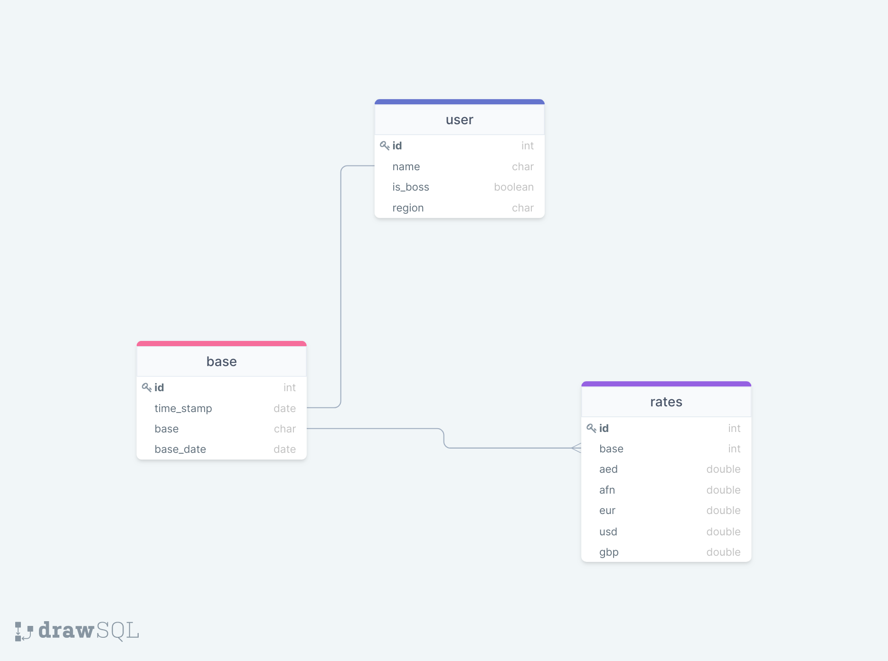

# zeppelin

### What is this all about?
This is a simple python application intended to provide a working example of ExchangeRate external API. The goal of these endpoint is to be simple, well-documented and to provide a base for developers to develop to build upon. The data gotten from the API is stored in a PostgreSQL database.

### How to use the program
- Go to https://exchangeratesapi.io/ and sign up for a free API key.
- Creat a clone using https://github.com/Dalin01/zeppelin.git
- Install all the dependencies
- Go to config.py, fill in your relevant information; endpoint, api_key and params
- Run python index.py 

### Downloading the data
Observations: 
- The data from the API was fairly structured.
- Downloading data for the year was a bit confusing. 
- The API was quite easy to use and well documented.

### Data Model 

- Users are store in a table and has fields for region and is_boss. The User model has 1-1 relationship with the base table.
- The base table constains the base currency, date and has 1 - many relationship with the rates table
- The rates table contains the rate currencies as columns. 
Users would be able to see get the base based on their region. This excludes the boss, as he would be able to see EUR and USD. This would be done on the fly using SQL. 

The default base on EUR, and all other can be gotten from performing a simple conversion. 

### Test
A simple test was perform using Unittest. 

